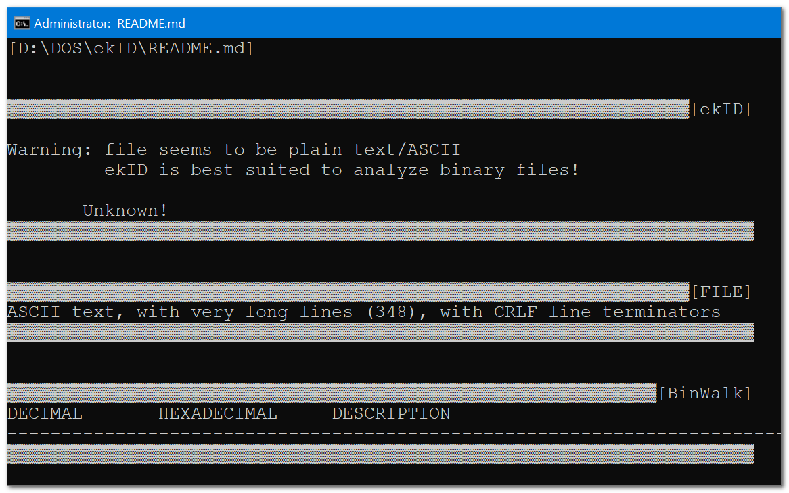

file inspection tools (kit) to figure-out what the file is and its embedded data.
wrapped nicely with a batch file for an easy drag and drop.

uses:
1. TrID (https://mark0.net) - slightly modified. exe compiled based on binary segments (known as "magic") collected its own signatures.
2. GNU FILE - exe compiled by "git-for-windows" project, based on `darwinsys.com/file`. same as above, "magic" file has a different format.
3. ExifTool (https://exiftool.org/) - slightly modified. exe patched perl with needed libs. extract mostly from media files (can also modify stuff).
4. BinWalk (https://github.com/ReFirmLabs/binwalk) - optional, needs python running and `python` to be available in system's `PATH`. does pretty much what TrID and FILE do, based on a LOT of "magic" files (different format), can dig into archives. most of the functionality needs linux packages that will not work with Windows (can even extract some basic archives).

output (and errors) are saved to machine's temp folder, filename has `ekid__` prefix and `.txt` suffix folder, and the original filename and extension in the middle. the script tells the path, and you can also uncomment last command before `pause` to auto-open notepad.

screenshots
  

 
 
 
 
 

this single batch file can be easily set to be a context-menu of every file (see `resources/ekID/context_menu/Context Menu- Shell Tools {Add New Context Menu}.reg` (you will need to edit the path, depanding where you've put this entire folder structure..)

 

Licenses. my work - The UnLicensed (public domain), TrID - AGPL 3.0, GNU FILE - GNU/GPL, BinWalk - MIT.